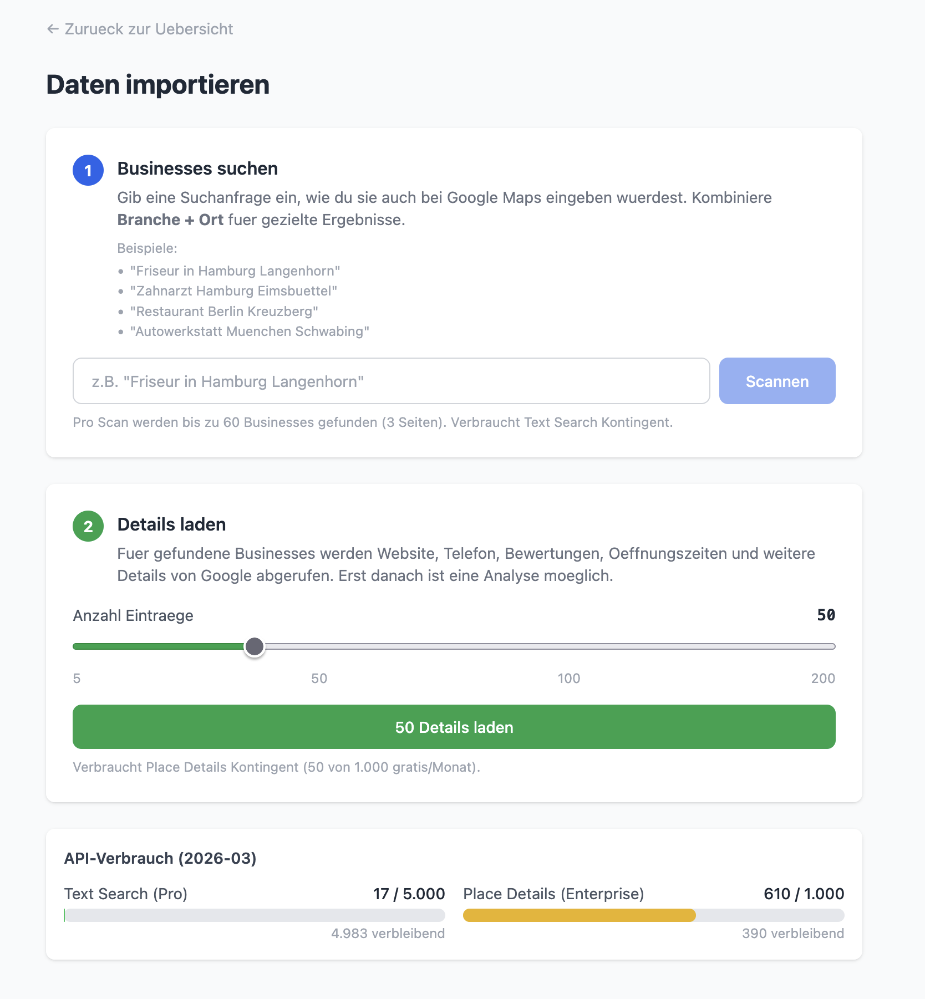
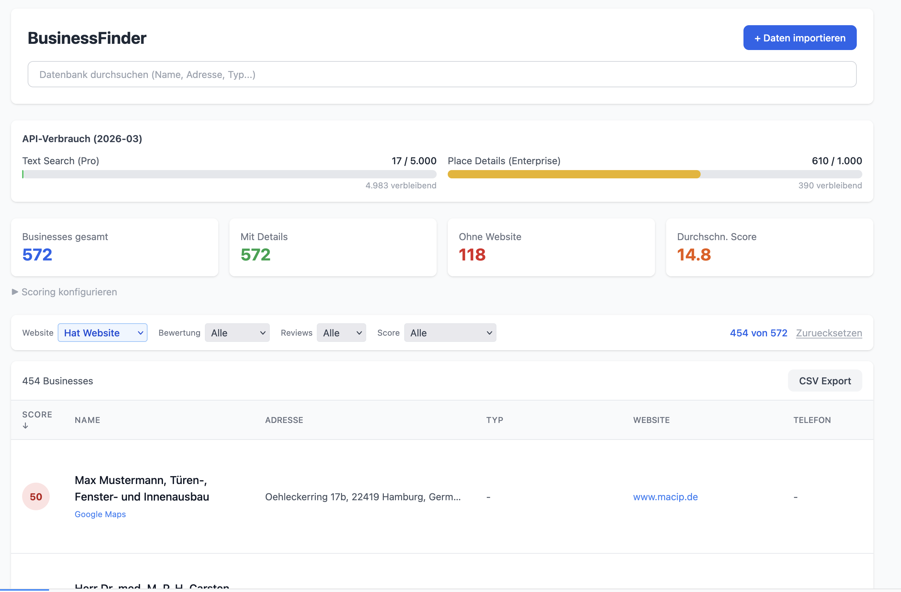
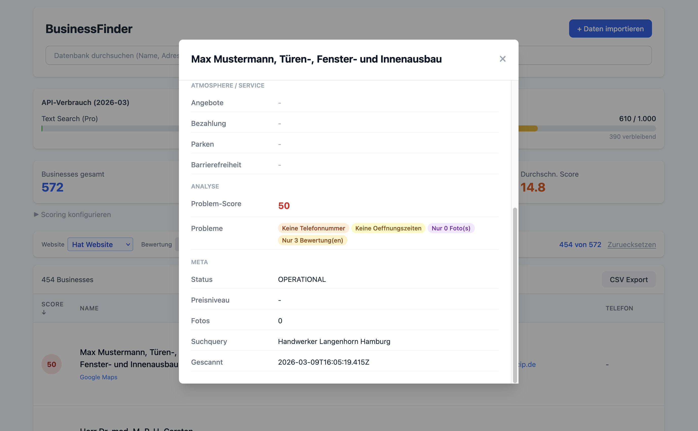

# BusinessFinder

Tool zum Finden von Businesses mit Optimierungspotenzial (keine Website, fehlende Daten, schlechte Bewertungen) via Google Places API (New). Gedacht als Lead-Quelle fuer Webentwicklung / Online-Marketing.

> [!CAUTION]
> Dieses Tool nutzt die Google Places API, die nach dem Gratis-Kontingent kostenpflichtig wird. Text Search kostet $0.032/Aufruf, Place Details $0.025/Aufruf. Bei intensiver Nutzung koennen schnell zweistellige Betraege anfallen. Immer den API-Verbrauch im Blick behalten und ggf. Budget-Limits in der Google Cloud Console setzen.

## Setup

```bash
# Dependencies installieren
npm install
cd frontend && npm install && cd ..

# API Key konfigurieren
cp .env.example .env
# GOOGLE_PLACES_API_KEY=dein_key eintragen

# Frontend bauen + Server starten
cd frontend && npm run build && cd ..
npm run server
# -> http://localhost:3001
```

Fuer Entwicklung: `cd frontend && npm run dev` (Vite auf Port 5173, Proxy auf 3001).

## Architektur

```
src/
  server.ts          Express API Server (Port 3001)
  scanner.ts         Scan-Logik: Text Search + Detail Fetch
  analyzer.ts        Problem-Score Berechnung (konfigurierbar)
  config.ts          Umgebungsvariablen + Pfade
  api/places.ts      Google Places API (New) Client
  db/schema.ts       SQLite Schema + Migrationen
  db/repository.ts   Datenbank-Zugriff (CRUD, Stats, Usage)

frontend/src/
  App.tsx             Hauptkomponente, State-Management, Routing
  api.ts              API Client (fetch-Wrapper)
  components/
    SearchBar.tsx      Textsuche (DB) + Navigation zur Import-Seite
    ImportPage.tsx     Eigene Seite fuer Scan + Details laden
    StatsPanel.tsx     Statistik-Karten + Scoring-Config
    UsagePanel.tsx     API-Verbrauch Anzeige
    FilterBar.tsx      Kombinierbare Filter-Dropdowns
    BusinessTable.tsx  Sortierbare Tabelle mit Detail-Modal
    BusinessDetail.tsx Detail-Ansicht (Modal) mit allen Feldern
    ScoringConfig.tsx  Konfigurierbare Scoring-Regeln
    ProblemsTag.tsx    Farbige Problem-Badges
```

## Google Places API

Nutzt die **Google Places API (New)** (POST-basiert, Field Masks bestimmen Pricing-Tier).

### Zwei-Schritt Scan

1. **Text Search** (Pro-Tier, 5.000 gratis/Monat)
   - Sucht nach Query (z.B. "Friseur in Hamburg Langenhorn")
   - Paginiert bis zu 3 Seiten (max. 60 Ergebnisse pro Query)
   - Speichert Basis-Daten + Foto-Referenzen

2. **Place Details** (Enterprise + Atmosphere, 1.000 gratis/Monat)
   - Laedt Details fuer gescannte Businesses
   - Website, Telefon, Bewertungen, Oeffnungszeiten, Reviews
   - Atmosphere-Flags (delivery, dineIn, reservable, etc.)
   - Payment/Parking/Accessibility Options

### API-Verbrauch

Wird in `api_usage` Tabelle getrackt und im Frontend angezeigt. Limits:

| Endpunkt | Gratis/Monat |
|----------|-------------|
| Text Search (Pro) | 5.000 |
| Place Details (Enterprise) | 1.000 |

**Foto-Referenzen** werden kostenlos aus der Text Search gespeichert (Enterprise Photo API zum Abruf: 1.000 gratis/Monat, noch nicht implementiert).

## Datenbank

SQLite mit WAL-Mode (`data/businessfinder.db`). Tabellen:

### businesses
Alle Business-Daten. Wichtige Felder:
- `id` (PK) - Google Place ID
- `details_fetched` - 0=nur Text Search, 1=Details geladen
- `problem_score` - berechneter Score (hoeher = mehr Probleme)
- `problems` - JSON Array der erkannten Probleme
- `atmosphere` - JSON mit Service-Flags (delivery, reservable, etc.)
- `reviews_json` - JSON Array der Google Reviews
- `photo_refs` - JSON Array der Foto-Referenzen

### scoring_config
Konfigurierbare Scoring-Regeln:

| Code | Default-Punkte | Beschreibung |
|------|---------------|-------------|
| NO_WEBSITE | 30 | Keine Website |
| NO_REVIEWS | 20 | Keine Bewertungen |
| NO_PHONE | 15 | Keine Telefonnummer |
| NO_HOURS | 15 | Keine Oeffnungszeiten |
| FEW_REVIEWS | 10 | Weniger als 10 Bewertungen |
| FEW_PHOTOS | 10 | Weniger als 3 Fotos |
| LOW_RATING | 10 | Bewertung unter 3.5 |

Punkte und aktiv/inaktiv sind ueber die GUI konfigurierbar. Nach Aenderung werden alle Businesses neu berechnet.

### api_usage
Monatlicher API-Verbrauch pro Endpunkt.

## API Endpunkte

| Methode | Pfad | Beschreibung |
|---------|------|-------------|
| POST | `/api/scan` | Neuen Scan starten (kostet API-Calls) |
| POST | `/api/fetch-details` | Details fuer ungescannte Businesses laden |
| GET | `/api/businesses?q=` | Businesses aus DB laden (optionaler Suchtext) |
| GET | `/api/businesses/top?limit=` | Top Businesses nach Score |
| GET | `/api/stats` | Statistiken (Anzahl, Durchschnitt, etc.) |
| GET | `/api/usage` | API-Verbrauch aktueller Monat |
| GET | `/api/scoring-config` | Aktuelle Scoring-Regeln |
| PUT | `/api/scoring-config` | Scoring-Regeln speichern |
| POST | `/api/recalculate` | Alle Scores neu berechnen |
| GET | `/api/export/csv` | CSV-Export aller Businesses |

## Screenshots

<p>
  
  
  
</p>

## GUI Features

- **Textsuche**: Durchsucht DB nach Name, Adresse, Typ, Suchquery (kein API-Verbrauch)
- **Import-Seite**: Eigene Seite mit Zwei-Schritt-Workflow (Scan + Details laden), Limit-Slider, Beispielen
- **Status-Anzeige**: Auffaellige Ergebnis-Box mit Link zur Uebersicht nach Scan/Details
- **Filter**: Kombinierbare Dropdowns (Website, Bewertung, Reviews, Score)
- **Sortierung**: Klick auf Spaltenkoepfe (Score, Name, Rating, Reviews, Typ)
- **Detail-Modal**: Klick auf Tabellenzeile zeigt alle Details
- **Scoring-Config**: Aufklappbares Panel zum Anpassen der Scoring-Regeln
- **CSV-Export**: Download aller Businesses als CSV
- **API-Verbrauch**: Live-Anzeige mit Fortschrittsbalken
